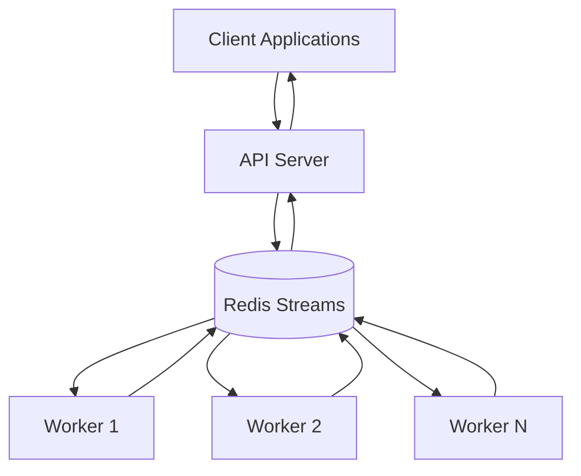

# OpenHands Redis Worker Mode

## Overview

Redis Worker Mode is a distributed architecture for OpenHands that separates the API layer from the conversation processing layer using Redis Streams as a message queue. This enables horizontal scaling, better resource utilization, and improved fault tolerance for handling multiple concurrent conversations.

## Architecture

### High-Level Components



### Core Components

#### 1. API Server
- **Role**: Handles client connections and conversation management
- **Responsibilities**:
  - Maintains conversation manager (without processing controller)
  - Maintains API event stream for client communication
  - Publishes `NewConversationEvent` to Redis when conversations are created
  - Runs API Consumer service to listen for worker responses
  - Forwards worker events to appropriate conversation streams

#### 2. Redis Streams Message Queue
- **Technology**: Redis Streams with consumer groups
- **Features**:
  - Reliable message queuing with persistence
  - Partitioning for scalability (default: 4 partitions)
  - Consumer groups for load balancing
  - Automatic message acknowledgment
  - Dead letter queue capabilities

#### 3. Worker Processes
- **Role**: Process conversations using OpenHands agents
- **Responsibilities**:
  - Run Conversation Consumer to listen for `NewConversationEvent`
  - Process conversations using conversation manager and controller
  - Maintain Worker Event Stream for conversation processing
  - Publish `ProcessConversationEvent` back to Redis
  - Handle conversation completion and error scenarios

#### 4. Consumer Groups and Partitioning
- **Stream Partitions**: Messages are distributed across multiple Redis streams (`conversation_partition_0`, `conversation_partition_1`, etc.)
- **Consumer Groups**: Workers form consumer groups (`conversation_workers`, `api_consumers`) for load balancing
- **Round-Robin Assignment**: Partitions are distributed among active consumers using round-robin strategy

## Message Flow

### 1. Conversation Creation Flow
```
Client Request → API Server → NewConversationEvent → Redis Stream → Worker Consumer
```

### 2. Conversation Processing Flow
```
Worker Consumer → Start Conversation → Worker Event Stream → Event Forwarder → ProcessConversationEvent → Redis Stream → API Consumer → API Event Stream → Client
```

### Message Types

#### NewConversationEvent
Published by API Server, consumed by Workers:
```json
{
    "conversation_id": "conv_123",
    "event_type": "new_conversation",
    "conversation_init_data": {...},
    "user_id": "user_123",
    "initial_user_msg": "Hello",
    "agent_config": {...}
}
```

#### ProcessConversationEvent
Published by Workers, consumed by API Server:
```json
{
    "conversation_id": "conv_123",
    "event_type": "process_conversation",
    "event_data": {...},
    "source": "worker_001",
    "status": "processing"
}
```

## Auto-Rebalancing

### How It Works

The Redis Worker Mode implements automatic rebalancing to distribute work evenly among available workers:

#### 1. Consumer Registration
- Workers register themselves in Redis hash: `consumers_{group_name}`
- Registration includes consumer name and timestamp
- Triggers rebalance version increment

#### 2. Heartbeat System
- **Interval**: 5 seconds (configurable via `heartbeat_interval`)
- **Timeout**: 15 seconds (configurable via `heartbeat_timeout`)
- Workers continuously update their timestamp in Redis
- Inactive consumers are automatically removed

#### 3. Rebalance Triggers
- New consumer joins the group
- Existing consumer leaves or becomes inactive
- Consumer heartbeat timeout detected
- Manual rebalance version increment

#### 4. Partition Assignment Strategy
- **Algorithm**: Round-robin distribution
- **Process**:
  1. Get sorted list of active consumers
  2. Assign partitions based on consumer index: `partition % num_consumers == consumer_index`
  3. Store assignments in Redis: `partition_assignments_{group_name}`

#### 5. Rebalance Detection
- Workers check rebalance version every 2 seconds (configurable via `rebalance_check_interval`)
- Version changes or consumer list changes trigger rebalancing
- Uses Redis distributed lock (`rebalance_lock`) to prevent conflicts

#### 6. Pending Message Claims
- During rebalance, workers claim pending messages from inactive consumers
- Uses Redis `XCLAIM` command with 60-second idle time
- Ensures no message loss during consumer failures

### Configuration Parameters
```toml
[worker]
heartbeat_interval = 5          # Seconds between heartbeats
heartbeat_timeout = 15          # Seconds before consumer considered inactive
rebalance_check_interval = 2    # Seconds between rebalance checks
queue_num_partitions = 4        # Number of stream partitions
```

## Graceful Shutdown

### Signal Handling
Both consumers and publishers implement graceful shutdown through signal handlers:

```python
def _setup_shutdown_handlers(self) -> None:
    """Set up signal handlers for graceful shutdown."""
    def handler(signum, frame):
        print(f'Shutting down consumer {self.consumer_name}')
        self.stop()
        exit(0)

    signal.signal(signal.SIGINT, handler)   # Ctrl+C
    signal.signal(signal.SIGTERM, handler)  # Docker/systemd stop
```

### Conversation Consumer Graceful Shutdown

The `ConversationConsumer` implements a sophisticated graceful shutdown mechanism specifically designed to handle active conversations safely:

#### 1. Shutdown Initiation
```python
def graceful_stop(self) -> None:
    """Initiate graceful shutdown process."""
    if self._shutdown_initiated:
        return

    self._shutdown_initiated = True
    logger.info(f'Initiating graceful shutdown for consumer: {self.consumer_name}')

    # Run async shutdown in the event loop
    asyncio.run_coroutine_threadsafe(
        self._graceful_shutdown_async(), self.loop
    )
```

#### 2. Step-by-Step Shutdown Process

The graceful shutdown follows a structured 5-step process:

##### Step 1: Stop Message Consumer
```python
# Stop the message consumer to prevent new messages
logger.info(f'Step 1: Stopping message consumer: {self.consumer_name}')
self.message_consumer.stop()
```
- Prevents new conversation requests from being processed
- Allows current conversations to continue

##### Step 2: Wait for Active Conversations
```python
# Wait for all active conversations to finish
logger.info(f'Step 2: Waiting for active conversations: {self.consumer_name}')
await self._wait_for_conversations_to_finish()
```

**Detailed Conversation Waiting Logic:**
```python
async def _wait_for_conversations_to_finish(self) -> None:
    """Wait for all active conversations to finish with timeout."""
    start_time = time.time()
    check_interval = 5  # Check every 5 seconds

    running_state = [AgentState.RUNNING, AgentState.LOADING]

    while time.time() - start_time < self.shutdown_timeout:
        # Get all running agent loops
        running_loops = await self.conversation_manager.get_running_agent_loops(
            filter_to_states=running_state
        )

        if not running_loops:
            logger.info('All conversations finished, proceeding with shutdown')
            return

        elapsed_time = time.time() - start_time
        remaining_time = self.shutdown_timeout - elapsed_time

        logger.info(
            f'Waiting for {len(running_loops)} active conversations. '
            f'Time remaining: {remaining_time:.1f}s'
        )

        await asyncio.sleep(min(check_interval, remaining_time))
```

**Timeout Handling:**
```python
# If timeout reached, force close remaining conversations
if running_loops:
    logger.warning(
        f'Shutdown timeout ({self.shutdown_timeout}s) reached. '
        f'Force closing {len(running_loops)} remaining conversations'
    )
    await self._force_close_conversations(running_loops)
```

##### Step 3: Stop Publisher
```python
# Stop the publisher and cleanup
logger.info(f'Step 3: Stopping publisher: {self.consumer_name}')
if self.publisher:
    self.publisher.stop()
```

##### Step 4: Shutdown Conversation Manager
```python
# Shutdown conversation manager
logger.info(f'Step 4: Shutting down conversation manager')
await self._shutdown_conversation_manager()
```

**Conversation Manager Cleanup:**
```python
async def _shutdown_conversation_manager(self) -> None:
    # Check if async context manager
    if hasattr(self.conversation_manager, '__aexit__'):
        await self.conversation_manager.__aexit__(None, None, None)

    # Cancel cleanup tasks
    if hasattr(self.conversation_manager, '_cleanup_task'):
        cleanup_task = getattr(self.conversation_manager, '_cleanup_task')
        if cleanup_task and not cleanup_task.done():
            cleanup_task.cancel()
            await cleanup_task
```

##### Step 5: Stop Event Loop
```python
# Stop the event loop
logger.info(f'Step 5: Stopping event loop')
await self._stop_event_loop()
```

#### 3. Configuration Options

```python
def __init__(
    self,
    consumer_name: str,
    message_consumer: BaseConsumer,
    publisher: BasePublisher,
    conversation_manager: ConversationManager,
    shutdown_timeout: int = 300,  # 5 minutes default timeout
):
```

**Shutdown Timeout Configuration:**
- **Default**: 300 seconds (5 minutes)
- **Purpose**: Maximum time to wait for conversations to finish naturally
- **Behavior**: After timeout, remaining conversations are force-closed
- **Configurable**: Can be set during ConversationConsumer initialization

### Redis Consumer Shutdown Process

#### 1. Stop Signal Reception
- Consumer receives SIGINT or SIGTERM
- Sets `is_running = False` to stop message processing loop

#### 2. Consumer Cleanup
```python
def stop(self) -> None:
    """Stop the consumer gracefully."""
    print(f'Stopping consumer {self.consumer_name}')
    self.is_running = False

    try:
        # Backend-specific cleanup
        self.cleanup_consumer()
    except Exception as e:
        print(f'Error in consumer cleanup: {e}')

    try:
        self.disconnect()
    except Exception as e:
        print(f'Error disconnecting: {e}')
```

#### 3. Redis-Specific Cleanup
```python
def cleanup_consumer(self) -> None:
    """Cleanup Redis consumer - unregister and stop heartbeat."""
    self.unregister_consumer()  # Remove from active consumers
```

#### 4. Consumer Unregistration
- Removes consumer from Redis hash: `consumers_{group_name}`
- Increments rebalance version to trigger partition redistribution
- Allows remaining consumers to take over assigned partitions

#### 5. Connection Cleanup
- Closes Redis client connection
- Stops heartbeat thread
- Releases any held resources

### Publisher Shutdown Process

#### 1. Atomic State Management
```python
def stop(self) -> None:
    """Stop the publisher gracefully."""
    print(f'Stopping publisher {self.publisher_name}')

    # Clear running state atomically
    self._running_event.clear()

    try:
        self.disconnect()
    except Exception as e:
        print(f'Error disconnecting: {e}')
```

#### 2. Thread Safety
- Uses `threading.Event` for atomic state management
- Ensures thread-safe shutdown in multi-threaded environments

### Conversation Force Closure

When conversations don't finish within the timeout, they are force-closed:

```python
async def _force_close_conversations(self, conversation_ids: set[str]) -> None:
    """Force close conversations that didn't finish within timeout."""
    for conversation_id in conversation_ids:
        try:
            logger.info(f'Force closing conversation: {conversation_id}')
            await self.conversation_manager.close_session(conversation_id)
        except Exception as e:
            logger.error(f'Error force closing conversation {conversation_id}: {e}')
```

### Benefits of Graceful Shutdown
1. **Conversation Preservation**: Active conversations are allowed to complete naturally
2. **Data Integrity**: No conversation state is lost during shutdown
3. **Clean State Management**: Proper cleanup of conversation resources
4. **Timeout Protection**: Prevents indefinite waiting for stuck conversations
5. **No Message Loss**: Pending messages are claimed by other consumers
6. **Clean Partition Redistribution**: Remaining workers automatically rebalance
7. **Resource Cleanup**: Proper connection and thread cleanup
8. **Fast Recovery**: New workers can immediately pick up the load

### Shutdown Timeout Configuration

You can configure the shutdown timeout when creating the conversation consumer:

```bash
# Environment variable (if supported)
export CONVERSATION_SHUTDOWN_TIMEOUT=600  # 10 minutes

# Or in application code
conversation_consumer = ConversationConsumer(
    consumer_name="worker_001",
    message_consumer=redis_consumer,
    publisher=redis_publisher,
    conversation_manager=conversation_manager,
    shutdown_timeout=600  # 10 minutes
)
```

## Configuration

### TOML Configuration File

Add the following section to your `config.toml`:

```toml
[worker]
# Worker mode: "standalone" (default) or "multi_worker"
mode = "multi_worker"

# Queue configuration (required when mode is "multi_worker")
queue_type = "redis"
queue_host = "localhost"
queue_port = 6379
queue_db = 0
queue_password = ""              # Optional: Redis password
queue_num_partitions = 4                    # Number of stream partitions
queue_max_messages_per_partitions = 1000   # Max messages per partition before trimming

# Advanced Redis consumer settings
heartbeat_interval = 5           # Seconds between heartbeats
heartbeat_timeout = 15           # Seconds before consumer considered inactive
rebalance_check_interval = 2     # Seconds between rebalance checks
```


### Redis Stream Message Management (`max_messages_per_partitions`)

The `queue_max_messages_per_partitions` configuration controls automatic stream trimming to prevent unbounded memory growth:

#### How It Works

**Automatic Stream Trimming:**
```python
# In RedisPublisher.publish_message()
if self.max_messages_per_partitions:
    if (
        self.redis_client.xlen(stream_name)
        >= self.max_messages_per_partitions
    ):
        # Trim to half the limit when threshold is reached
        self.redis_client.xtrim(
            stream_name,
            maxlen=int(self.max_messages_per_partitions / 2),
            approximate=True,
        )
```

**Key Characteristics:**
- **Threshold Check**: Before each message publish, checks stream length
- **Automatic Trimming**: When limit reached, trims to 50% of the limit
- **Approximate Trimming**: Uses Redis `XTRIM APPROXIMATE` for performance
- **Per-Partition**: Each partition stream is managed independently

#### Configuration Examples

**Low-Volume Applications:**
```toml
[worker]
queue_max_messages_per_partitions = 500   # Small memory footprint
```

**Medium-Volume Applications:**
```toml
[worker]
queue_max_messages_per_partitions = 1000  # Default value
```

**High-Volume Applications:**
```toml
[worker]
queue_max_messages_per_partitions = 5000  # Larger buffer for burst handling
```

**Memory-Constrained Environments:**
```toml
[worker]
queue_max_messages_per_partitions = 100   # Very small buffer
```

**Disable Trimming (Not Recommended):**
```toml
[worker]
queue_max_messages_per_partitions = 0     # No automatic trimming
```

#### Memory Impact Calculation

**Estimating Memory Usage:**
```python
# Approximate memory per message: 1-5KB (depending on conversation data)
# Total memory per partition = max_messages_per_partitions * avg_message_size

# Example with default settings:
# 4 partitions × 1000 messages × 2KB avg = ~8MB memory
# Peak during trimming: 4 partitions × 1000 messages × 2KB = ~8MB
# After trimming: 4 partitions × 500 messages × 2KB = ~4MB
```

**Memory Planning:**
```bash
# Calculate total Redis memory for OpenHands:
# Base Memory = partitions × max_messages × avg_message_size
# Peak Memory = Base Memory × 2 (before trimming)

# Example for high-volume setup:
# 8 partitions × 5000 messages × 3KB = ~120MB
# Peak: ~240MB
```

#### Performance Considerations

**Trimming Performance:**
- **Approximate Mode**: Fast but not exact count
- **Exact Mode**: Slower but precise (not used in implementation)
- **Background Operation**: Doesn't block message publishing
- **O(log N)**: Redis XTRIM is logarithmic complexity

**Recommendations:**
1. **Monitor Memory**: Use Redis `INFO memory` to track usage
2. **Adjust Based on Load**: Higher values for bursty workloads
3. **Consider Message Size**: Large conversations need higher limits
4. **Test Trimming Impact**: Monitor for message loss during high throughput

#### Monitoring and Alerting

**Redis Commands for Monitoring:**
```bash
# Check stream lengths
redis-cli XLEN conversation_partition_0
redis-cli XLEN conversation_partition_1
redis-cli XLEN conversation_partition_2
redis-cli XLEN conversation_partition_3

# Check total memory usage
redis-cli INFO memory

# Get detailed stream info
redis-cli XINFO STREAM conversation_partition_0
```

**Alerting Thresholds:**
- **Warning**: Stream length > 80% of limit
- **Critical**: Stream length > 95% of limit
- **Memory Alert**: Redis memory > 80% of available

#### Message Loss Prevention

**Understanding Trimming Behavior:**
- **Oldest Messages Removed**: FIFO (First In, First Out)
- **Active Conversations**: Only affects old/completed conversations
- **Consumer Groups**: Acknowledged messages are safe to trim
- **Pending Messages**: May be lost if not acknowledged before trimming

**Best Practices:**
```toml
[worker]
# Set limit based on expected conversation duration and volume
# Formula: limit = max_concurrent_conversations × avg_messages_per_conversation × safety_factor

# For 100 concurrent conversations, 10 messages each, 2x safety:
queue_max_messages_per_partitions = 2000

# Consider message acknowledgment speed
heartbeat_interval = 3          # Faster acknowledgments
heartbeat_timeout = 10          # Quicker failure detection
```

### Production Redis Configuration

For production deployments, consider:

```toml
[worker]
mode = "multi_worker"
queue_type = "redis"
queue_host = "redis-cluster.example.com"
queue_port = 6379
queue_db = 0
queue_password = "your-secure-password"
queue_num_partitions = 8                    # Higher partitions for more workers
queue_max_messages_per_partitions = 3000    # Higher limit for production load
heartbeat_interval = 3                      # More frequent heartbeats
heartbeat_timeout = 10                      # Faster failure detection
```

## Deployment Guide

### 1. Start Redis Server

```bash
# Using Docker
docker run -d --name redis -p 6379:6379 redis:7-alpine

# Using Redis CLI to verify
redis-cli ping
# Should return: PONG
```

Update config

```toml
[worker]
mode = "multi_worker"
queue_type = "redis"
queue_host = "localhost"
queue_port = 6379
queue_db = 0
queue_num_partitions = 4
queue_max_messages_per_partitions = 1000
```

### 2. Start API Server

```bash
# Start API server
python -m openhands.server.app
```

The API server automatically starts an API consumer service as a background thread.

### 3. Start Worker Processes

```bash
# Worker
python -m openhands.server.conversation_consumer
```

### 4. Scaling Workers

Add more workers dynamically:

```bash
# Additional workers will automatically join and trigger rebalancing
python -m openhands.server.conversation_consumer
```

### 5. Docker Compose Example

```yaml
version: '3.8'
services:
  redis:
    image: redis:7-alpine
    ports:
      - "6379:6379"
    command: redis-server --appendonly yes
    volumes:
      - redis_data:/data

  api-server:
    build: .
    ports:
      - "3000:3000"
    environment:
      - WORKER_MODE=multi_worker
      - WORKER_QUEUE_HOST=redis
      - WORKER_QUEUE_PORT=6379
    depends_on:
      - redis
    command: python -m openhands.server.app

  worker:
    build: .
    environment:
      - WORKER_MODE=multi_worker
      - WORKER_QUEUE_HOST=redis
      - WORKER_QUEUE_PORT=6379
    depends_on:
      - redis
    command: python -m openhands.server.conversation_consumer

volumes:
  redis_data:
```

## Advantages

### 1. **Horizontal Scalability**
- **Dynamic Worker Scaling**: Add/remove workers without downtime
- **Load Distribution**: Automatic partition-based load balancing
- **Resource Isolation**: API and processing layers can scale independently
- **Multi-Machine Deployment**: Workers can run on different servers

### 2. **High Availability**
- **Fault Tolerance**: Worker failures don't affect API server
- **Automatic Recovery**: Failed workers' partitions are redistributed
- **Message Persistence**: Redis Streams provide durable message storage
- **No Single Point of Failure**: Multiple workers provide redundancy

### 3. **Performance Benefits**
- **Concurrent Processing**: Multiple conversations processed simultaneously
- **Resource Optimization**: Dedicated workers for CPU-intensive tasks
- **Reduced Latency**: API server remains responsive during heavy processing
- **Queue Management**: Efficient message queuing prevents overwhelm

### 4. **Operational Excellence**
- **Independent Deployments**: Update workers without affecting API
- **Better Resource Utilization**: Optimized resource allocation per component
- **Monitoring and Observability**: Clear separation for metrics and logging
- **Graceful Shutdowns**: Clean worker termination with message preservation

### 5. **Development Benefits**
- **Modular Architecture**: Clear separation of concerns
- **Testing Isolation**: Test API and workers independently
- **Framework Extensibility**: Easy to add new worker types
- **Configuration Flexibility**: Fine-tuned settings per component

## Disadvantages

### 1. **Increased Complexity**
- **Infrastructure Requirements**: Additional Redis deployment and management
- **Configuration Overhead**: More environment variables and settings
- **Debugging Challenges**: Distributed tracing across multiple processes
- **Deployment Complexity**: Coordinating multiple service deployments

### 2. **Resource Overhead**
- **Memory Usage**: Additional Redis memory for message queues
- **Network Latency**: Inter-service communication overhead
- **Process Management**: Multiple processes to monitor and maintain
- **Connection Pools**: Additional Redis connections per worker

### 3. **Operational Challenges**
- **Redis Dependency**: System unavailable if Redis fails
- **Message Queue Management**: Monitoring queue depth and performance
- **Worker Health Monitoring**: Tracking worker status and performance
- **Data Consistency**: Ensuring message ordering and delivery guarantees

### 4. **Development Overhead**
- **Testing Complexity**: Integration tests across multiple services
- **Local Development**: More complex development environment setup
- **Error Handling**: Distributed error scenarios and recovery
- **Message Schema Evolution**: Coordinating message format changes

### 5. **Cost Considerations**
- **Infrastructure Costs**: Additional Redis hosting costs
- **Monitoring Tools**: Distributed monitoring and alerting setup
- **Maintenance Overhead**: More systems to patch and update
- **Training Requirements**: Team knowledge of distributed systems

## When to Use Redis Worker Mode

### ✅ **Recommended For:**

1. **High-Volume Applications**
   - Processing >100 concurrent conversations
   - Need for horizontal scaling
   - Variable load patterns

2. **Production Environments**
   - High availability requirements
   - Need for fault tolerance
   - Resource optimization goals

3. **Enterprise Deployments**
   - Multi-tenant applications
   - Strict SLA requirements
   - Advanced monitoring needs

4. **Development Teams**
   - Experienced with distributed systems
   - Have Redis infrastructure
   - Can handle operational complexity

### ❌ **Not Recommended For:**

1. **Small Applications**
   - <10 concurrent conversations
   - Simple use cases
   - Limited resource requirements

2. **Development/Testing**
   - Local development environments
   - Quick prototypes
   - Simple testing scenarios

3. **Resource-Constrained Environments**
   - Limited memory/CPU
   - Cost-sensitive deployments
   - Simple infrastructure requirements

4. **Inexperienced Teams**
   - New to distributed systems
   - Limited operational experience
   - Preference for simplicity

## Monitoring and Troubleshooting

### Key Metrics to Monitor

1. **Queue Health**
   - Queue depth per partition
   - Message processing rate
   - Failed message count

2. **Worker Performance**
   - Worker CPU/memory usage
   - Message processing time
   - Worker heartbeat status

3. **Redis Performance**
   - Redis memory usage
   - Connection count
   - Command latency

### Common Issues and Solutions

#### 1. Workers Not Processing Messages
**Symptoms**: Messages accumulating in queues
**Solutions**:
- Check worker connectivity to Redis
- Verify consumer group registration
- Review worker logs for errors

#### 2. Uneven Load Distribution
**Symptoms**: Some workers overloaded, others idle
**Solutions**:
- Increase number of partitions
- Check partition assignment logic
- Verify worker registration

#### 3. Message Processing Delays
**Symptoms**: High conversation response times
**Solutions**:
- Add more workers
- Optimize message processing code
- Increase Redis resources

#### 4. Redis Connection Issues
**Symptoms**: Connection timeouts, Redis errors
**Solutions**:
- Check Redis server health
- Verify network connectivity
- Review Redis configuration limits

## Migration from Standalone Mode

### 1. Pre-Migration Checklist
- [ ] Redis server available and configured
- [ ] Worker deployment strategy planned
- [ ] Monitoring and alerting configured
- [ ] Rollback plan prepared

### 2. Migration Steps

#### Step 1: Deploy Redis
```bash
# Start Redis with persistence
docker run -d --name redis -p 6379:6379 \
  -v redis_data:/data \
  redis:7-alpine redis-server --appendonly yes
```

#### Step 2: Update Configuration
```toml
[worker]
mode = "multi_worker"
queue_type = "redis"
queue_host = "localhost"
queue_port = 6379
queue_num_partitions = 4
```

#### Step 3: Deploy Workers
```bash
# Start workers before switching API server
python -m openhands.server.conversation_consumer \
    --consumer-name "worker_001" \
    --redis-host "localhost" \
    --redis-port 6379
```

#### Step 4: Switch API Server
```bash
# Restart API server with new configuration
export WORKER_MODE=multi_worker
python -m openhands.server.app
```

### 3. Validation
- Verify new conversations are processed by workers
- Check Redis streams for message flow
- Monitor worker health and performance
- Test graceful shutdown procedures

### 4. Rollback Plan
- Keep standalone configuration backed up
- Have procedure to quickly switch back
- Monitor for 24-48 hours post-migration
- Document any issues encountered

## Best Practices

### 1. **Configuration Management**
- Use environment variables for deployment-specific settings
- Keep sensitive information (passwords) in secure vaults
- Document all configuration options
- Use infrastructure as code

### 2. **Monitoring and Alerting**
- Monitor Redis memory usage and performance
- Track worker health and message processing rates
- Set up alerts for queue depth and worker failures
- Implement distributed tracing

### 3. **Security**
- Use Redis AUTH for production deployments
- Implement network security (VPC, firewalls)
- Regularly update Redis and OpenHands versions
- Monitor for security vulnerabilities

### 4. **Performance Optimization**
- Tune partition count based on expected load
- Optimize worker resource allocation
- Monitor and adjust heartbeat intervals
- Use Redis clustering for high-throughput scenarios

### 5. **Operational Excellence**
- Implement proper logging across all components
- Create runbooks for common operational tasks
- Practice disaster recovery procedures
- Maintain documentation and diagrams

---

This Redis Worker Mode provides a robust, scalable solution for high-volume OpenHands deployments. While it introduces operational complexity, the benefits of horizontal scaling, fault tolerance, and performance optimization make it ideal for production environments requiring reliable, distributed conversation processing.
